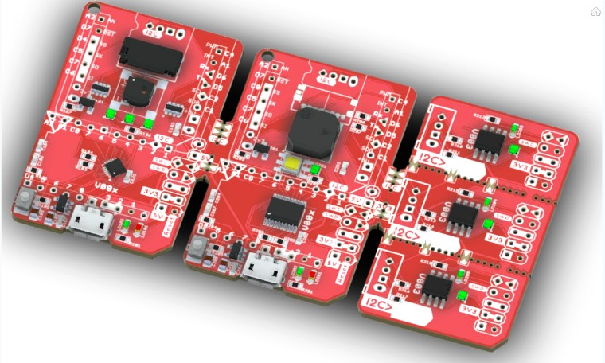
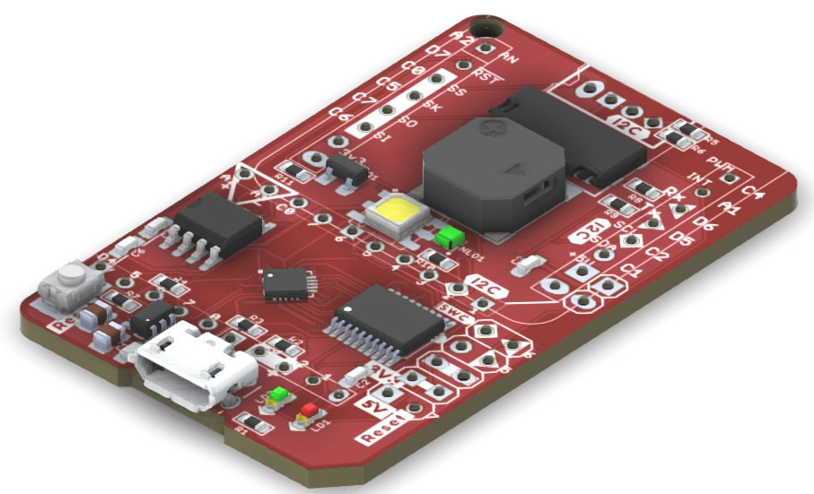
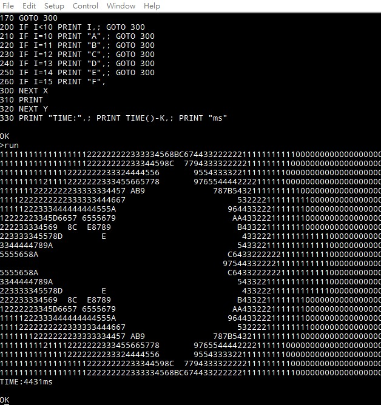

# mBusWCH32V00x
!WIP

### Latest updates upon open source RISC-V mcu Wch32v00x (002,003,004,005,006,007) dev board.
Packages include QFN-20, TSSOP-20, SOP-8, board schematic & PCB exported to KiCAD8 in hardware folder.

  
 

Also import the Toyoshiki's TTBasic with ASCIIchart.bas example into the 16KB flash...  
See software folder for all PlatformIO projects.  

 
 

References:
-----
[V003 Intro.](https://ch405-labs.com/ch32v003_intro/) CH32V003 introduction about programming the CH32V003 RISC-V microcontroller  
[CH32V00x Pinout/Ch32v003fun References](https://github.com/cnlohr/ch32v003fun) cnlohr github repository  
[RV003USB](https://github.com/cnlohr/rv003usb) Using USB on the CH32V003  
[WCH Boards](https://github.com/wagiminator/Development-Boards) wagiminator Wch dev boards  
[V003 Neopixel](https://github.com/wagiminator/CH32V003-NeoPixel-Pendant) TinyBling - Sparkly NeoPixel Pendant based on CH32V003  
[CH32V003 UART](https://pallavaggarwal.in/2023/09/23/ch32v003-programming-uart/) CH32V003 UART RX/TX remap  

 
